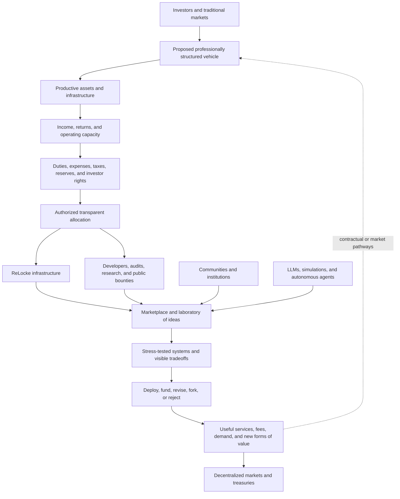

# ReLocke Funding and Sustainability Model

## A public concept for connecting productive capital, open infrastructure, and decentralized experimentation

**Working paper — August 2026**

> [!CAUTION]
> This document describes a proposed funding architecture for discussion and
> development. It is not an offer to sell securities, tokens, fund interests,
> or any other financial instrument. No investment vehicle, portfolio,
> dividend policy, token entitlement, return, allocation formula, or investor
> right is established by this paper. Each would require separate legal,
> financial, tax, custody, governance, and regulatory design.

## The purpose

ReLocke needs a durable way to fund, build, secure, and scale open
infrastructure without allowing one investor, company, community, blockchain,
or ideology to capture it.

The proposed answer is a nexus between traditional finance, decentralized
finance, and open-source technology. Productive capital from traditional
markets could help sustain ReLocke and finance competing experiments. ReLocke
would provide the shared interface through which developers and communities
build those systems, while people, LLMs, simulations, and autonomous agents
stress-test their assumptions and expose their vulnerabilities.

Investors would gain directional influence through transparent capital
allocation. They could support projects, infrastructure, and architectures
that they believe will produce value. That influence should remain soft power:
developers and communities retain the freedom to reject the preferred
direction, compete for resources, fork open technology, and demonstrate that
another model works better.

The objective is not to declare one financial system correct. It is to create
a place where proposed systems can be made visible, executable, comparable,
and open to challenge.

## The capital constraint

Decentralized software still operates inside a world financed primarily
through traditional markets. Compute, semiconductors, networking, data
centers, energy, security, skilled labor, banking, custody, accounting, and
legal structures require capital in conventional currencies.

Open-source communities can create technical freedom while remaining dependent
on concentrated sources of capital. Projects with strong ideas struggle to
fund engineering, audits, infrastructure, and distribution. Investors, in
turn, often cannot inspect a proposed governance or economic system deeply
enough to distinguish a robust architecture from a persuasive narrative.

ReLocke is intended to address both sides of that problem:

- give open systems a path toward durable funding;
- give capital better tools for understanding what it supports;
- give developers an environment in which competing ideas can be implemented;
- give machines and people the ability to identify weaknesses before large
  amounts of capital or authority are committed; and
- preserve community exit when investors, developers, or governors disagree.

## The proposed economic relay

A future, professionally structured investment vehicle could hold a portfolio
of productive assets. One possible mandate could include income-producing
assets such as dividend-paying public equities and infrastructure associated
with compute, networking, data centers, energy, and the broader machine
economy. The final vehicle, mandate, eligible assets, and jurisdictions do not
yet exist.

If such a vehicle were established, earnings would first remain subject to its
legal duties, operating expenses, taxes, reserves, investor rights, and
reinvestment policy. A disclosed and authorized portion of the remaining
economic capacity could then support:

- ReLocke's core infrastructure and security;
- developers and independently operated services;
- audits, integrations, documentation, and public tooling;
- controlled deployments and institutional simulations;
- research into new financial and governance architectures; and
- public challenge, vulnerability, and model-design rewards.

This creates an economic relay rather than an immediate replacement of one
financial system by another.

The return path is not automatic. A decentralized project may create revenue,
fees, assets, services, or demand that benefit its own participants. Value
would flow back to a traditional vehicle only through an explicit investment,
contract, ownership right, service relationship, or market transaction. It
must never be implied merely because ReLocke helped the project develop.

## From extraction to creation

Traditional finance is capable of extracting and concentrating value, but it
also finances productive assets, infrastructure, and long-term enterprise.
DeFi can open participation and make rules and state more visible, but it can
also reproduce speculation, capture, opacity, and fragile incentives in new
forms.

ReLocke should not romanticize either system. Its role is to make the
relationship between them inspectable and progressively redesignable.

During the transition, the proposed structure can operate as a value-capture
bridge: part of the economic value produced in traditional markets could
sustain open digital infrastructure. That infrastructure can then enable new
systems that create useful services, markets, communities, and demand. Some of
that value may remain within decentralized systems; some may return to
traditional markets when participants realize profits, pay for real-world
goods, or finance physical infrastructure.

The aim is to turn a one-directional extraction cycle into a contestable loop
of investment, creation, evidence, and reinvestment.

## Directional capital without protocol capture

The model is analogous to a decentralized form of window guidance: capital
does not need to command the entire system in order to influence its direction.
Investors can make preferences visible by allocating funds toward projects,
teams, and architectures they believe are productive.

That guidance should remain plural and reversible:

- allocations and conflicts should be visible;
- milestones and results should be measurable;
- competing projects should remain possible;
- access to ReLocke should not depend on accepting one allocator's direction;
- communities should be able to fork and exit; and
- capital should be able to revise or stop support when evidence changes.

Capital gets voice. Communities retain exit. ReLocke preserves the interface
through which the resulting systems can continue to be understood and used.

## A marketplace of ideas—and attacks

ReLocke is intended to become the place where proposed financial and
governance architectures are forced to confront reality before they become
entrenched.

Developers can implement competing models. Communities can bring their needs
and local knowledge. Investors can fund the systems they believe deserve to be
tested. LLMs and autonomous agents can search for adversarial strategies,
analyze permission graphs, model treasury flows, test incentive assumptions,
and generate alternative designs.

Members of the public should also be able to contribute. Defined research,
security, governance, and economic-model challenges could reward people who
identify vulnerabilities, explain failure modes, produce counterexamples, or
improve a design. The applicable scope, evidence requirements, reward, review
process, eligibility, and dispute mechanism would need to be published before
each program begins.

The goal is not to make criticism a side effect. It is to make criticism part
of the production process.

Models do not prove safety or legitimacy. LLMs can be wrong. Simulated actors
may not resemble real people. A technically correct contract can encode a
destructive incentive, and an attractive economic model can conceal
concentrated authority. Independent review, professional expertise, explicit
authorization, staged deployment, and continuous challenge remain essential.

## The possible role of tokens

Tokens may eventually provide useful coordination mechanisms, but they are not
the starting point and should not be asked to represent several incompatible
things at once.

A future token might represent access, governance, rewards, a claim on an
asset, or an investment right. Those categories have different economic and
legal consequences. No token should be described as supported by dividends or
portfolio assets unless an enforceable structure defines the entitlement,
custody, accounting, supply, cross-chain representation, transfer rules,
recovery, and priority of claims.

Possible future uses of authorized portfolio income could include direct
infrastructure spending, developer grants, public challenge rewards,
treasury capitalization, or a legally structured economic mechanism involving
a token. ReLocke has not selected among those alternatives.

The principle is simple: productive income may help sustain the environment,
but narrative cannot substitute for enforceable rights. Tokenization changes
the record and coordination layer; it does not create underlying value or
remove the legal character of an investment.

## Why ReLocke can sit at the center

ReLocke is not tied to one permanent blockchain. It currently supports WAX,
XPR Network, Vaulta, and Telos as independently governed targets. The broader
architecture is designed to preserve a common surface while the systems
beneath it diverge.

The current technology provides the beginning of the proposed nexus:

- [ReLockeQL](https://relocke.io/docs/relockeql-api-infrastructure) reads live
  contract ABIs and exposes compatible accounts, permissions, actions, tables,
  state, and transaction preparation through a typed GraphQL model;
- the [Contract Console](https://relocke.io/docs/contract-console) gives people
  a graphical interface for discovering contracts, querying state, and
  preparing actions;
- [Antelope WebAuthn](https://github.com/pur3miish/antelope-webauthn) and K1
  signing paths help separate transaction preparation from explicit approval;
- [Agentic ABI](https://github.com/relocke/agentic-abi) enriches executable
  interfaces with structured intent, risks, side effects, provenance, and
  human-readable context; and
- natural-language-assisted authoring and serverless CDT compilation create
  reviewable source, WASM, and ABI artifacts that can be deployed with the
  selected account's authorization.

Antelope's hierarchical named permissions, weighted authorities, action-linked
permissions, system contracts, ABIs, and open-source lineage make it a strong
initial architecture for testing programmable institutions. ReLocke builds
above that architecture so the nexus can evolve without depending permanently
on one blockchain, steward, or implementation.

Read the complete [Technology and Roadmap](./TECHNOLOGY.md) and
[White Paper](./WHITEPAPER.md) for the technical and institutional thesis.

## The transition path

The financial connection must be developed in stages.

### 1. Sustain and harden the technology

Finance ReLocke's core engineering, security, infrastructure, documentation,
modeling environment, and commercial validation through clearly defined
development capital and operating revenue.

### 2. Build the public laboratory

Expand the tools for describing, deploying, simulating, attacking, and
comparing economic and governance systems. Establish transparent contribution,
research, and challenge-reward programs.

### 3. Design the investment structure

Only with qualified advisers should a future vehicle define its jurisdiction,
manager, mandate, eligible assets, custody, accounting, tax, audit, fees,
liquidity, conflicts, investor rights, and allocation policy.

### 4. Connect authorized income to open infrastructure

If a vehicle is established, publish how obligations are satisfied and how any
remaining economic capacity may support ReLocke, developers, and experiments.
Measure the results of those allocations.

### 5. Integrate DeFi where it improves the system

Add verifiable records, programmable permissions, transparent treasuries, and
decentralized participation where they provide better coordination. Any
tokenized investment right must correspond to an existing legal and economic
right rather than attempting to replace one with a narrative.

### 6. Let new systems compete

Allow communities, developers, investors, and machines to create and challenge
new architectures of ownership, value, governance, and exchange. Systems that
demonstrate utility can attract participation and capital. Systems that fail
can be revised, forked, or rejected.

## Open design questions

This model remains incomplete by design. The next iterations must answer:

1. What organization initially owns and operates ReLocke infrastructure?
2. What commercial services can sustain the platform before any vehicle exists?
3. What assets, jurisdictions, and duties would govern a future vehicle?
4. How would income be divided among investor obligations, reserves,
   reinvestment, infrastructure, developers, and public challenges?
5. What economic or governance role—if any—does a token genuinely need to play?
6. How are conflicts between ReLocke, investors, funded projects, blockchains,
   and communities disclosed and constrained?
7. How are simulations, vulnerabilities, public contributions, and project
   outcomes evaluated without allowing the evaluator to capture the system?
8. What rights remain portable when a community forks or migrates?

These questions are not weaknesses to conceal. They are the work ReLocke is
being created to make possible.

## The intended outcome

ReLocke aims to become an open meeting point between minds, machines, and
capital.

Traditional finance can contribute productive assets, established legal
structures, and investment capacity. DeFi can contribute programmable
settlement, transparent state, open participation, and new coordination
mechanisms. Open-source software can preserve the freedom to inspect, adapt,
fork, and exit. AI and autonomous agents can expand the range of systems that
can be modeled and attacked.

ReLocke's role is to connect these capabilities without pretending their
differences have disappeared. If successful, individuals and communities will
be able to engineer new structures of value; investors will be able to shape
promising work through transparent allocation; developers will be able to
compete for capital; and the public will be able to challenge the systems that
seek to govern them.

That is the transition: from closed financial architecture to an open market
of systems capable of being built, tested, funded, contested, and improved.

## References and further reading

1. [ReLocke Technology and Roadmap](./TECHNOLOGY.md)
2. [ReLocke White Paper](./WHITEPAPER.md)
3. [Antelope accounts and permissions](https://docs.antelope.io/docs/latest/protocol/accounts_and_permissions/)
4. [Antelope custom action-linked permissions](https://docs.antelope.io/docs/latest/getting-started/smart-contract-development/linking-custom-permission/)
5. [Antelope reference system contracts](https://docs.antelope.io/reference-contracts/latest/)
6. [W3C Web Authentication](https://www.w3.org/TR/webauthn-3/)
7. [SEC staff statement on tokenized securities, January 28, 2026](https://www.sec.gov/newsroom/speeches-statements/corp-fin-statement-tokenized-securities-012826-statement-tokenized-securities)

