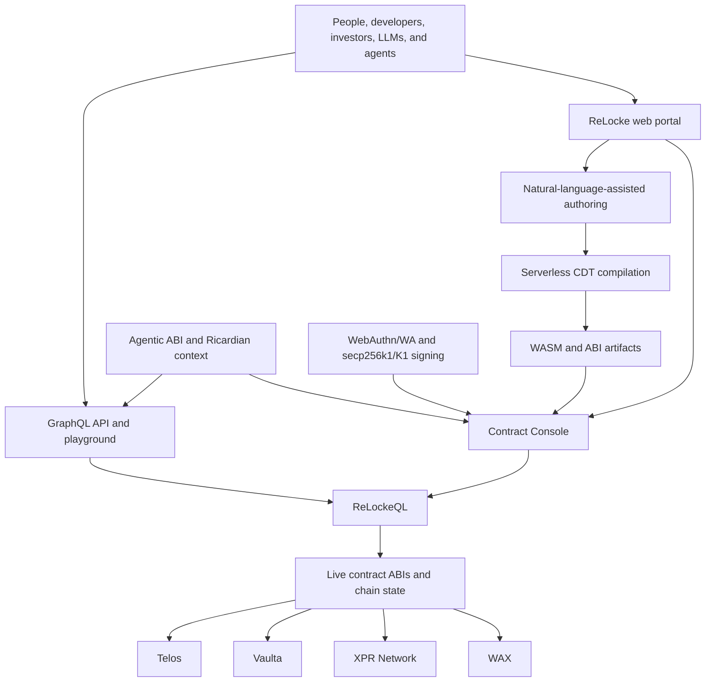

# ReLocke Technology and Roadmap

> [!WARNING]
> ReLocke is under active development. This document separates capabilities
> available today from the direction in which the platform is being developed.

ReLocke provides a common interface above independently governed blockchains.
WAX, XPR Network, Vaulta, and Telos are supported targets today. Each blockchain
keeps its own state, contracts, permissions, infrastructure, economics, and
governance; ReLocke makes their compatible surfaces easier for people and
machines to discover and use.

## How the platform fits together

## Current platform

### ReLockeQL

[ReLockeQL](https://relocke.io/docs/relockeql-api-infrastructure) reads the
published ABI of compatible smart contracts and exposes accounts, permissions,
actions, tables, state, and transaction history through one typed GraphQL
model. Developers, applications, LLMs, and users can work through a consistent
interface across supported blockchains while keeping the selected chain
explicit.

The API can prepare typed mutations and compose ordered actions into one atomic
transaction. The ReLocke GUI uses the same infrastructure so people can
discover contracts, read ABI-derived documentation, query cross-chain state,
and prepare actions without writing GraphQL by hand.

[Read the guide](https://relocke.io/docs/relockeql-api-infrastructure) ·
[Open the GraphQL playground](https://relocke.io/api/playground) ·
[API endpoint](https://relocke.io/api) ·
[Source](https://github.com/pur3miish/ReLockeQL)

### ReLocke Contract Console

The [Contract Console](https://relocke.io/docs/contract-console) turns deployed
smart contracts into a discoverable cross-chain workspace. Users can browse
native, linked, or tracked contracts; inspect ABI and Agentic ABI documentation;
query tables; assemble multi-contract action workflows; and review the chain,
accounts, parameters, and permissions before signing.

The console gives people a graphical surface over the same live contract model
that ReLockeQL makes available to developers, LLMs, applications, and autonomous
systems. It reduces dependence on one-off frontends and manual RPC integration.

[Read the guide](https://relocke.io/docs/contract-console) ·
[Open the console](https://relocke.io/smart-contracts)

### Antelope WebAuthn

[Antelope WebAuthn](https://github.com/pur3miish/antelope-webauthn) connects
passkeys and platform authenticators to Antelope-compatible signatures.
Private-key operations remain protected by the user's authenticator and local
approval surface—such as biometrics, a device PIN, TPM, secure enclave, or
hardware security key—while public keys can be attached to on-chain account
permissions.

WebAuthn is a W3C standard implemented across major browser and operating-system
ecosystems, including Apple, Google, and Microsoft platforms. Some
authenticators are device-bound; some passkeys may be securely synchronized by
the user's platform provider. ReLocke preserves that distinction.

ReLocke prepares an inspectable action, the user reviews it, the authenticator
approves it locally, and the selected blockchain enforces its own on-chain
permissions. ReLocke also supports secp256k1/K1 authorization paths.

[How device-secured access works](https://relocke.io/docs/device-secured-digital-assets) ·
[Source](https://github.com/pur3miish/antelope-webauthn)

### Agentic ABI

[Agentic ABI](https://github.com/relocke/agentic-abi) enriches the executable
ABI with structured contract identity, intent, permissions, risks, side
effects, provenance, versions, icons, Ricardian terms, and human-readable
context. People and machines can inspect the same model without confusing
documentation with executable authority.

The standard ABI remains authoritative for serialization. Deployed code,
account permissions, and live chain state remain authoritative for execution.
The enriched context makes those executable structures easier to discover,
explain, review, and integrate.

[Read the guide](https://relocke.io/docs/agentic-abi) ·
[Specification and tooling](https://github.com/relocke/agentic-abi)

### Browser contract development

ReLocke provides natural-language-assisted contract authoring and a serverless
CDT compilation service. C++ source can be sent to a Vercel Function-compatible
endpoint and compiled inside an isolated, disposable Vercel Sandbox environment.
The service returns reviewable WASM and ABI artifacts that can be deployed
client-side with the selected account's explicit authorization.

[Read the native contract guide](https://relocke.io/docs/native-antelope-smart-contracts)

### Multi-chain access infrastructure

The ReLocke portal routes requests through monitored RPC infrastructure for its
supported blockchains. ReLockeQL can also be used as a library or server with
explicitly selected endpoints, allowing developers and communities to operate
their own access path rather than depending permanently on the hosted service.

## Roadmap

The roadmap extends the working contract, API, signing, compilation, and GUI
layers into a broader environment for designing and testing economic and
governance systems.

| Area | Available today | Direction |
| --- | --- | --- |
| **Natural-language authoring** | Assisted smart-contract authoring connected to browser compilation. | Describe broader financial, governance, permission, and institutional structures in familiar languages and translate them into reviewable specifications, tests, contract artifacts, and interfaces. |
| **Modeling and stress testing** | Inspectable contract actions, tables, permissions, and atomic workflows. | Compare alternative structures, simulate state changes and resource requirements, expose failure modes, and stress-test incentives before capital or authority is committed. |
| **Contract Console** | Cross-chain discovery, table queries, contract documentation, and multi-action workflows. | Version comparison, reusable system blueprints, transaction simulation, clearer risk explanations, and shareable reviewed workflows. |
| **Agentic interfaces** | Agentic ABI context and a GraphQL surface that people and machines can inspect. | Stronger policy constraints, provenance verification, simulation requirements, scoped authority, and explicit approval boundaries for autonomous workflows. |
| **Interoperability** | Shared interfaces for WAX, XPR Network, Vaulta, and Telos. | Additional adapters and independently operated access paths while preserving the identity, rules, and governance of each blockchain. |

Natural language is an authoring interface, not runtime truth. Generated systems
must remain understandable and should be reviewed, compiled, tested, simulated
where possible, audited in proportion to their risk, and explicitly authorized
before they control real assets or institutional authority.

## Explore

- [ReLocke](https://relocke.io)
- [Documentation](https://relocke.io/docs)
- [White paper](./WHITEPAPER.md)
- [Contract Console](https://relocke.io/smart-contracts)
- [ReLockeQL API playground](https://relocke.io/api/playground)
