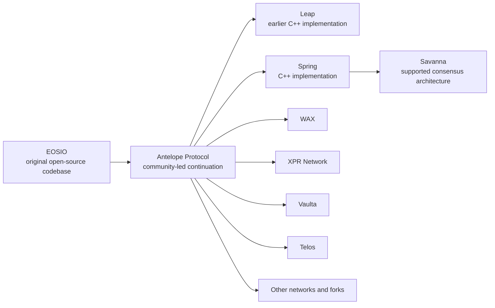
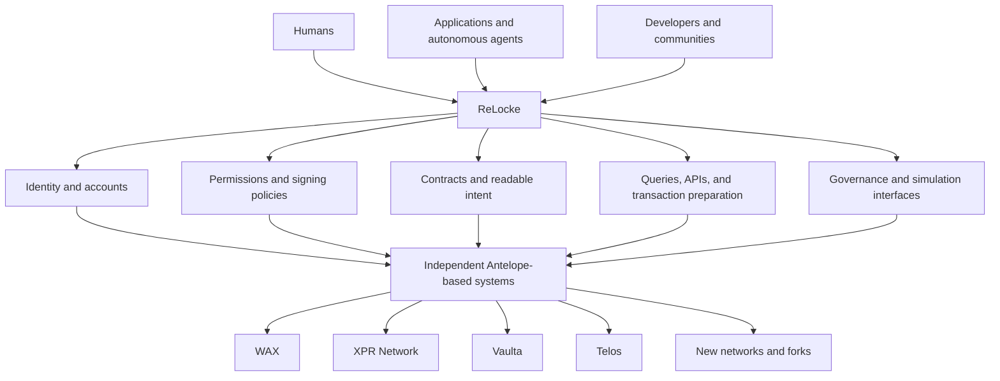
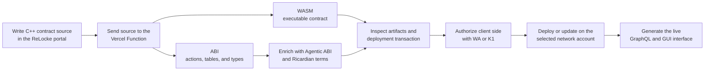
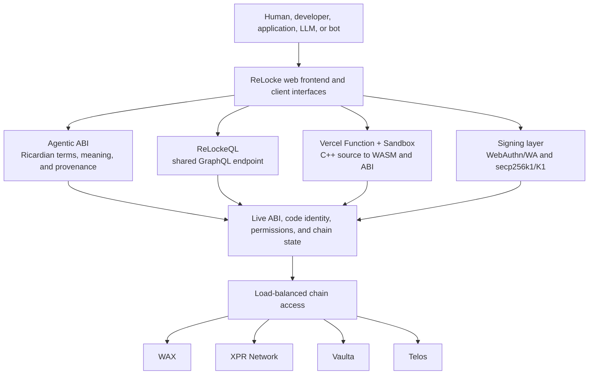
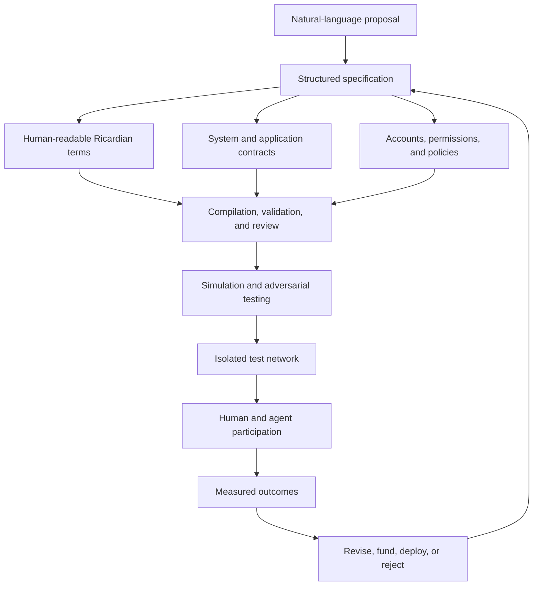

# ReLocke

## Making Decentralized Fragmentation Interoperable

**A technology and economic architecture for humans, developers, communities, and autonomous machines**

**Concept paper — August 2026**

> This document describes a technical direction and a proposed long-term
> economic model. It is not an offer to sell securities, tokens, or interests
> in an investment vehicle. RLOC Capital does not yet have a final legal,
> custody, tax, governance, or cross-chain structure. Any future offering would
> require separate definitive documents and appropriate professional advice.

## Abstract

Decentralization does not produce one permanent network, community, or model of
governance. It produces many. Communities disagree, software forks, economics
diverge, institutions change, and networks evolve at different speeds.

Fragmentation is therefore not an accidental failure of decentralization. It
is one of its natural consequences. The deeper failure occurs when users,
applications, and developers lose continuity each time the systems beneath
them diverge.

ReLocke is being built to make that fragmentation interoperable.

ReLocke is an adaptable interface above independently governed blockchain
networks. Its purpose is to give people, applications, developers, communities,
and autonomous agents a consistent way to discover accounts, understand
contracts, evaluate permissions, inspect state, prepare transactions, and move
between compatible systems. Networks remain free to change or fork; ReLocke
preserves a usable connection to them as they do.

The initial technical focus is the Antelope protocol family. Antelope is not a
single network. It is an open-source blockchain framework descended from EOSIO.
Independent networks such as WAX, XPR Network, Vaulta, and Telos use or derive
from this architecture while retaining their own governance, economics, and
communities. All four are supported ReLocke targets today. Spring is a current
C++ implementation of the Antelope protocol with support for Savanna consensus.
ReLocke is not dependent on any one of these names, stewards, implementations,
or networks. It is built around the durable capabilities of the open
architecture.

Across those four networks, ReLocke already provides a shared GUI and GraphQL
portal for people, developers, applications, LLMs, and autonomous agents. The
platform can query accounts and contract state, derive interfaces and
documentation from published ABIs, call actions, and prepare authorized smart-
contract deployments and updates. It also supports natural-language-assisted
smart-contract authoring through the web portal.

Alongside this technology proposition, ReLocke proposes a distinct, future
economic proposition: RLOC Capital. ReLocke would provide technical freedom,
interoperability, and continuity. Subject to legal and regulatory design, RLOC
Capital would provide financial governance through transparent capital
allocation. It could support infrastructure, developers, networks, and
experiments that demonstrate value without requiring the protocol to prohibit
competing approaches.

The resulting model combines voice and exit:

- capital can express a preference by funding productive work;
- communities can reject that preference and pursue another direction;
- developers can compete for users and resources;
- networks can fork or change their rules; and
- ReLocke can preserve interoperability across the resulting systems.

ReLocke is designed for a plural blockchain ecosystem: an interoperable market
of executable ideas in which networks can remain independent, compete, and
evolve.

## 1. The Thesis

The internet is becoming an economy shared by people and software.

Software agents can already search, negotiate, call APIs, propose transactions,
operate services, and manage constrained workflows. As these systems become
more capable, intelligence alone is insufficient. An agent also needs
authority.

Every economically meaningful agent must answer questions such as:

- Which identity or organization does it represent?
- Which systems may it access?
- What may it spend, and over what period?
- Which actions may it execute without intervention?
- Which actions require a person, quorum, or higher permission?
- What agreement describes its obligations?
- How can another party verify those constraints?
- How can its actions be inspected and audited afterward?

These are questions of identity, permission, computation, settlement,
governance, and capital. They cannot be solved by a language model alone.

ReLocke's central thesis is that economically or institutionally meaningful
actions need an independently verifiable coordination layer. Not every thought,
inference, or computation belongs onchain. Commitments, permissions, ownership,
budgets, approvals, and settlement are different: their value often depends on
multiple parties being able to inspect the same result.

Blockchain infrastructure can provide that shared execution and recordkeeping
boundary. ReLocke makes the boundary intelligible and usable across more than
one independently operated network.

## 2. What Antelope Is—and Is Not

Precise terminology matters.

Antelope is a protocol family and blockchain framework, not “the Antelope
network.” The architecture's lineage can be summarized as:

The original corporate steward's discontinuation of EOSIO development did not
erase the software. Open-source code, independent operators, and communities
continued the architecture under different stewardship. That history is not a
distraction from ReLocke's thesis; it is evidence for it. The technology
outlived one organization and continued to change.

Antelope is particularly relevant because it separates primitive protocol
capabilities from higher-level system behavior. Its documentation describes
features such as resource allocation, producer selection, voting, fee
schedules, account creation, and token economics as capabilities that can be
implemented or changed through system contracts. Its account model also
supports named permissions, weighted authorities, and links between a
permission and a specific contract action.

This makes the architecture malleable at more than one level:

1. Applications can deploy or upgrade WebAssembly smart contracts.
2. Networks can change higher-level system contracts and economic rules.
3. Communities can modify the open-source core or launch a separate network.
4. Implementations can evolve while preserving broad protocol lineage.

That flexibility creates differences between networks. It also creates the
need for an interface capable of understanding those differences.

ReLocke is designed for the architecture, not for permanent dependence on one
chain, token, foundation, company, or node implementation.

## 3. Decentralization Creates Fragmentation

Systems fragment for legitimate reasons:

- communities prefer different governance rules;
- applications require different resource and fee models;
- jurisdictions impose different legal requirements;
- operators make different tradeoffs among performance, resilience, and cost;
- monetary policies diverge;
- projects adopt protocol features at different times; and
- participants leave when they believe an institution has become captured or
  stagnant.

Attempts to eliminate these disagreements generally recreate central control.
ReLocke takes the opposite position: sovereign systems should be allowed to
diverge, but divergence should not force every user and application to begin
again.

The distinction is between fragmentation and isolation.

Fragmentation permits experimentation and exit. Isolation destroys continuity.
ReLocke aims to preserve continuity without erasing sovereignty.

The networks remain the systems of execution and settlement. ReLocke is the
adaptive surface through which participants understand and use them.

## 4. ReLocke as the Persistent Interface

ReLocke is not intended to become another monolithic Layer 1. It is a portal,
developer layer, and coordination surface above multiple systems.

The present platform combines a shared GraphQL API, ABI-derived contract
interfaces, load-balanced access to supported chains, signing support, a
Vercel Function-compatible CDT compilation endpoint backed by isolated Vercel
Sandbox microVMs, natural-language contract authoring, and a web frontend. WAX,
XPR Network, Vaulta, and Telos are supported targets rather than hypothetical
future integrations.

The long-term interface has five responsibilities.

### 4.1 Discover

ReLocke should identify the selected network, account, contract, token,
permissions, available actions, and relevant state. It must distinguish
similarly named networks and assets and avoid silently substituting one
provider, chain, or contract for another.

### 4.2 Explain

Executable interfaces are rarely self-explanatory. ReLocke should connect a
contract's live ABI and code identity to human-readable intent, risks,
authorization requirements, table meaning, side effects, and source
provenance. This context should be structured so that people, applications, and
LLMs can inspect the same model.

### 4.3 Constrain

Antelope's permission model can express narrower authorities beneath a more
powerful parent permission. ReLocke can use those primitives to help define
policies such as:

- an agent may call only specified contract actions;
- a service may spend only from a designated account or allowance;
- a permission may be changed or revoked by a human-controlled authority;
- actions above a threshold require an additional signer; or
- a workflow must be re-authorized after a defined condition.

The contract and network enforce only the rules actually encoded and deployed.
ReLocke must not present descriptive text as if it granted authority.

### 4.4 Prepare and verify

ReLocke should translate user or application intent into an inspectable
transaction proposal, resolve serialization from the live executable
interface, show the selected network and authority, simulate where possible,
and request the appropriate approval before signing or execution.

### 4.5 Adapt

When networks change endpoints, contracts, resource rules, protocol features,
or governance, ReLocke's chain profiles and adapters should isolate much of that
change from applications. Adaptation will never make genuinely incompatible
systems identical. It can give developers a stable set of concepts and make
differences explicit where they matter.

This is the sense in which ReLocke is malleable: it does not pretend every
network is the same. It maintains a common interface that can evolve as the
networks beneath it evolve.

## 5. The ReLocke Platform Today

ReLocke's broader architecture remains a direction, but the interoperability
layer already exists as working software. Its present components establish the
technical baseline from which the larger vision can be built.

### Supported networks and shared infrastructure

ReLocke currently supports WAX, XPR Network, Vaulta, and Telos. Each remains an
independent network with its own state, contracts, infrastructure, governance,
and economic rules. ReLocke connects them through a shared application surface.

The platform provides load-balanced access to the supported chains rather than
requiring every user or application to choose and maintain an individual node
connection. The [ReLocke website](https://relocke.io) then presents account,
contract, permission, table, action, and transaction functionality through a
common frontend.

This shared endpoint is operationally centralized infrastructure, but it does
not merge or replace the underlying networks. ReLockeQL can also be used as a
library or server with explicitly selected endpoints, allowing developers and
communities to operate their own access path.

### ReLockeQL

[ReLockeQL](https://github.com/pur3miish/ReLockeQL) provides a common GraphQL
client and server interface for account, contract, table, and transaction
operations across Antelope-based chains. It retrieves deployed contract ABIs
and converts their types, tables, and actions into a GraphQL schema. This lets a
shared API expose contract state as queries and contract actions as mutations
without hand-writing a separate integration for every contract.

Because the interface is derived from the live ABI, ReLocke can interact with
any compatible deployed smart contract on a supported chain whose ABI is
available. Applications can read tables and account state, construct actions,
prepare transactions, collect valid authorization, and submit signed
transactions through one GraphQL model. ReLockeQL's tested profiles include
Jungle, WAX, Vaulta, Telos, and XPR Network, and developers can configure other
compatible chains explicitly.

This establishes the basic abstraction principle: application code can use a
consistent query surface while retaining an explicit chain context.

### Agentic ABI

[Agentic ABI](https://github.com/relocke/agentic-abi) extends the executable ABI
with structured context for contract identity, actions, tables, external
triggers, authorization, side effects, source provenance, icons, and versions.
It connects three related but distinct artifacts:

- a Ricardian document records human-readable intent and expectations;
- a WebAssembly contract executes deterministic behavior; and
- an ABI describes how software calls actions and decodes data.

Agentic ABI makes those artifacts more legible to people and machines without
confusing documentation with executable authority.

This extends the conventional Application Binary Interface rather than
replacing it. The standard ABI remains the machine-readable definition used to
serialize actions and decode tables. The enriched Agentic ABI adds durable
semantic context: what the contract is, what its actions intend, which
permissions they require, which state and assets they may change, what external
effects may occur, where the source came from, and which version is being used.
The result is an interface that both conventional applications and reasoning
systems can inspect.

The same ABI-driven architecture allows ReLocke to document contracts across
its supported networks. The web interface can display existing Ricardian
contracts and richer Agentic ABI material beside the live executable
interface. An authorized contract maintainer can publish updated documentation
through the contract's ABI, allowing the description and the executable
interface to travel together.

A Ricardian contract may record terms intended to form or evidence a legally
binding agreement. Its legal effect still depends on the relevant facts and
law, including identity, notice, assent, capacity, document integrity,
governing law, and mandatory regulation. ReLocke therefore describes and
preserves Ricardian terms; it does not declare every published clause legally
binding merely because it appears in an ABI.

### Browser contract development and the CDT endpoint

ReLocke has deployed an Antelope CDT compiler through a Vercel
Function-compatible `POST /api/compile` endpoint used by the web portal. A user,
application, machine, or LLM-assisted workflow can submit C++ contract source
to the endpoint. Each compilation runs inside a disposable Vercel Sandbox
microVM restored from a reusable CDT snapshot. The function returns the two
deployable artifacts required by an Antelope account-deployed contract:
WebAssembly bytecode and its ABI.

The endpoint is a compilation backend, not a signing service. It should receive
source and build inputs, not account credentials or private keys. The returned
WASM and ABI can be inspected in the browser and then placed into a deployment
transaction that is authorized client side. Deployment still depends on the
selected network, target account, account permissions, transaction contents,
and valid signatures.

This architecture makes the web portal a common development surface while
keeping compilation and account authority separate. It also makes compiler
versioning, isolation, resource limits, source-retention policy, artifact
hashing, and reproducible-build provenance important parts of the endpoint's
security model.

This closes an important development loop:

### Signing and authorization

ReLocke supports Antelope-compatible WebAuthn signatures and K1 signatures
based on the secp256k1 curve. This allows the interface to serve both
authenticator-mediated approval flows and conventional Antelope account-key
flows while preserving the exact key type and authority required by the
selected network account.

In a WebAuthn flow, the credential's private key is protected by its
authenticator and is not disclosed to ReLocke. The corresponding public key can
be registered in the Antelope account's permission. Depending on the platform
and credential configuration, a passkey may be device-bound or synchronized
across a user's devices; WebAuthn should therefore not be described as making
every credential permanently inseparable from one operating system or device.

Signing is distinct from the GraphQL API. The API can discover the live ABI,
serialize actions, prepare a transaction, and submit its signed form; the
applicable credential or account key supplies authorization. This separation
allows the same contract interface to be used by people, applications, LLMs,
and bots without treating the ability to construct a transaction as permission
to execute it.

Together, the load-balanced chain infrastructure, ReLockeQL, CDT compilation,
Agentic ABI, signing layer, and frontend form the present ReLocke stack:

Future claims should remain equally testable. A roadmap item should not be
described as deployed infrastructure until its code, threat model, and behavior
can be inspected.

## 6. Human Authority and Machine Authority

Autonomous systems require bounded authority, not merely access to a private
key.

A useful authorization model separates at least three layers:

1. **Machine authority** allows unattended execution within narrow,
   inspectable limits.
2. **Human authority** can approve sensitive actions and change or revoke the
   machine's permission.
3. **Institutional authority** can require thresholds, multiple participants,
   delayed execution, or governance procedures.

ReLocke already supports Antelope WebAuthn signatures at the
human-authorization boundary, alongside secp256k1/K1 signing. WebAuthn is a W3C
standard for public-key credentials scoped to a relying party. Depending on the
authenticator and policy, an authentication ceremony can require user presence
or local user verification. Credential private keys remain managed by the
authenticator; the corresponding public key can be registered with an Antelope
account permission.

WebAuthn is not proof of humanity or proof of unique personhood. It can support
a narrower and more defensible claim: a particular credential performed an
authentication ceremony under stated user-presence or user-verification
requirements. ReLocke should preserve that distinction in both product design
and public language.

Similarly, an AI-generated transaction is not authorized merely because it is
well formed. The authority comes from the selected account permission and
signing policy. An agent may explain, simulate, and prepare an action; signing
must still follow the configured authorization boundary.

## 7. From Ideas to Executable Institutions

ReLocke already supports natural-language-assisted smart-contract authoring
through its web portal. A user can describe a contract in familiar language
and use that description to produce reviewable contract source and structure
before compilation, signing, or deployment.

The longer-term opportunity is to extend that working capability beyond an
individual contract. ReLocke can become an environment in which complete
economic and governance structures are specified, modeled, deployed, and
contested.

A person or community might describe an institution in the natural language
they know best—English, Mandarin, Thai, Japanese, or another language:

> Create a treasury funded by these sources. Allow this group to propose
> allocations. Require this threshold to approve them. Permit this agent to
> spend within this budget. Require a human credential above this amount.
> Distribute revenue under these conditions. Preserve these rights if the
> community migrates to a new network.

The next extension of ReLocke's existing LLM-assisted workflow can turn that
broader proposal into related artifacts:

The resulting specification could define more than an individual contract. It
could describe an institution's application architecture, accounts,
permissions, financial flows, treasury policy, voting model, override paths,
and governance rules. ReLocke could then use the existing browser compiler,
Agentic ABI conventions, transaction interface, and signing layer to turn the
reviewed design into deployable artifacts.

Natural language is an input, not the source of runtime truth. Translation also
introduces ambiguity: equivalent intent across two languages cannot be assumed
merely because an LLM produced both versions. Generated code must be compiled
and tested. Permission graphs must be verified. Economic assumptions must be
simulated. Security review must precede material value at risk. Legal terms
require qualified review and demonstrable assent where legal rights are
intended.

The objective is not to eliminate developers, auditors, economists, or lawyers.
It is to reduce the distance between a human proposal and a system that can be
inspected and tested.

## 8. A Computational Marketplace of Ideas

Political and economic systems are usually debated in prose before their
second-order effects can be observed. Programmable institutions allow more of
those assumptions to be made explicit.

Within a controlled environment:

- humans can propose objectives and constraints;
- developers can implement competing designs;
- agents can search for edge cases and adversarial strategies;
- simulated participants can expose incentive failures;
- communities can compare observable outcomes;
- markets can price risk and utility; and
- successful designs can attract users and capital.

This does not make simulation equivalent to reality. Models inherit their
assumptions, agents may not resemble real participants, and software tests
cannot settle questions of legitimacy. The value comes from making more
assumptions visible before a system controls real resources.

ReLocke can provide the shared workbench: specifications, test deployments,
visualized permission graphs, simulations, contract provenance, comparable
metrics, and pathways from experiment to production.

The underlying networks become a field of competing institutional designs.
ReLocke lets participants observe and move through that field without requiring
every design to converge.

## 9. Governance Through Voice and Exit

No decentralized system should depend on the permanent competence or
benevolence of its original creators.

Governance may become captured. A foundation may disappear. A network may make
choices unacceptable to part of its community. A technically valid fork may
become socially necessary.

ReLocke's model preserves two complementary powers:

- **Voice:** participants influence a system through proposals, votes, usage,
  contribution, and capital allocation.
- **Exit:** participants can leave, fork, redeploy, or adopt another compatible
  system when voice fails.

Exit is weakened when applications, accounts, tooling, and interfaces are so
tightly coupled to one network that migration becomes impractical. By moving
more discovery, semantic context, and application integration into an adaptable
layer, ReLocke can lower that cost.

ReLocke cannot guarantee a lossless migration. State, assets, counterparties,
legal rights, liquidity, and social legitimacy do not automatically transfer
between forks. The role of the interoperability layer is to expose those
differences, preserve portable components where possible, and help communities
coordinate an intentional transition.

## 10. RLOC Capital: Financial Governance Without Protocol Capture

Open-source technical freedom does not solve the capital problem.

AI and digital infrastructure depend on physical systems: compute hardware,
networking, data centers, energy, cooling, fabrication, and skilled labor.
Developers and infrastructure operators incur costs in traditional currencies.
Communities with good ideas still compete against well-capitalized institutions.

RLOC Capital is the proposed response to that constraint. It should be designed
as a separate legal and economic structure from ReLocke's initial technology
financing.

Subject to appropriate securities, investment-company, brokerage, custody,
tax, governance, and cross-border analysis, a future RLOC Capital vehicle could
allocate capital toward productive assets and infrastructure associated with
the machine economy. A defined portion of returns or available capital could
support open infrastructure, developers, audits, integrations, operators, and
governance experiments.

RLOC Capital would exercise soft power through allocation rather than hard
power through technical exclusion. It might fund one governance model, network,
or development team because it believes that work will be productive. Another
community must remain free to reject that direction, fork the technology, and
seek resources elsewhere.

Capital gets voice. Communities retain exit. ReLocke preserves connection after
exit.

### The RLOC boundary

The name “RLOC” must not ambiguously refer to a utility token, company share,
fund interest, governance right, and claim on portfolio returns at the same
time. If a future instrument conveys equity, distributions, portfolio economics,
or investment-fund rights, those rights and their legal treatment must be
explicit.

Tokenization does not remove the legal character of an instrument. In the
United States, SEC staff has stated that representing a security through a
crypto network does not change the application of federal securities laws.
Other jurisdictions apply their own regimes.

Until the structure is complete:

- RLOC Capital should be described as a proposal, not an operating fund;
- no public technology document should promise investor returns;
- no cross-chain representation should be launched without canonical supply,
  transfer, recovery, compliance, custody, and governance rules;
- the ReLocke development raise should use a conventional corporate instrument;
  and
- any future RLOC offering should use separate, jurisdiction-specific legal and
  disclosure documents.

This separation makes the technology thesis stronger. ReLocke can be built and
evaluated on its technical merits before a more complex capital vehicle is
asked to carry it.

## 11. Design Principles

ReLocke should be evaluated against the following principles.

### Explicit context

Every consequential operation should identify its network, account, contract,
asset, authority, endpoint, and expected side effects. Similar names are not
interchangeable.

### Inspect before execution

Interfaces should show the complete transaction, permission, and relevant
contract meaning before requesting a signature.

### Live executable truth

Serialization and available behavior must be resolved from the current
deployed ABI and chain state. Descriptive metadata can add meaning but cannot
override code.

### Least authority

Machines and applications should receive the narrowest permissions required
for their work. Higher authority should remain separable and revocable.

### Human-readable intent

Important actions should be accompanied by understandable terms, risks, and
consequences. Readable language supports review; it does not guarantee legal
effect or correct execution.

### Forkability

Specifications, adapters, and contracts should be open and reproducible enough
for a community to continue without ReLocke's original organization.

### Measured interoperability

ReLocke should not hide meaningful differences between networks. A common
interface is valuable only when exceptions, unsupported behavior, and migration
limits are explicit.

### Separation of powers

Technical maintainers, network governors, users, signers, and capital allocators
should not be silently collapsed into one authority.

## 12. Development Roadmap

The roadmap proceeds from demonstrable infrastructure toward higher-risk
economic coordination.

### Current baseline — Common interfaces

- supported targets for WAX, XPR Network, Vaulta, and Telos;
- ABI-derived GraphQL queries and mutations through ReLockeQL;
- a shared API endpoint backed by load-balanced chain access;
- a frontend for accounts, contracts, permissions, actions, and tables;
- browser-based contract authoring with a Vercel Function and isolated Sandbox
  compilation that returns WASM and ABI artifacts;
- client-side authorization for contract deployment and modification;
- natural-language-assisted smart-contract authoring through the web portal;
- Ricardian contract and Agentic ABI documentation surfaces; and
- Antelope WebAuthn/WA and secp256k1/K1 signing support.

### Phase I — Hardening and developer access

- harden ReLockeQL's multi-chain query and transaction interfaces;
- maintain explicit, testable chain profiles and provider health policies;
- isolate and harden compilation, pin CDT versions, and expose reproducible
  build provenance for generated WASM and ABI artifacts;
- expand Agentic ABI validation and contract provenance;
- improve self-hosted access to the same common interfaces;
- render readable actions, tables, permissions, and side effects; and
- document compatibility, trust assumptions, and failure boundaries.

### Phase II — Human and machine authorization

- harden existing passkey, WebAuthn/WA, and secp256k1/K1 approval flows;
- model permission graphs and linked action authorities;
- support policy-constrained agent transaction proposals;
- add transaction simulation and clear approval surfaces; and
- conduct independent security review of signing and authorization paths.

### Phase III — Multilingual institutional workbench

- expand existing natural-language contract authoring into multilingual,
  institution-scale proposals and reviewable contract projects;
- pair executable contracts with Ricardian and Agentic ABI context;
- generate tests, invariants, simulations, and adversarial scenarios;
- visualize governance, permissions, capital flows, and failure modes; and
- deploy isolated networks for human and machine experimentation.

### Phase IV — Portable governance

- define manifests for network, system-contract, and governance configurations;
- compare forks and policy variants;
- develop intentional migration and state-mapping tools;
- preserve source, build, ABI, and decision provenance; and
- create funding and contribution interfaces without binding technical access
  to one capital source.

### Phase V — RLOC Capital design

- select jurisdictions and qualified legal advisers;
- define the vehicle, investor rights, manager duties, and eligible assets;
- design custody, accounting, reporting, tax, compliance, and audit processes;
- specify any canonical cross-chain record only after the legal rights exist;
- disclose conflicts between ReLocke, the vehicle, networks, and funded teams;
  and
- proceed only through separate approved offering materials.

## 13. Risks and Open Questions

The architecture introduces substantial unresolved risks.

### Security

A common interface can become a high-value target. Compromised endpoints,
incorrect chain identification, malicious metadata, permission mistakes,
cross-chain accounting failures, generated-code defects, or signing-interface
attacks can cause irreversible loss. A hosted compiler also introduces build
and software-supply-chain risk; users need inspectable artifacts, pinned tool
versions, reproducible builds where practical, and explicit review before
deployment.

### Governance

Forkability does not guarantee legitimate governance. Communities can split in
ways that confuse users, duplicate assets, or create incompatible claims to
identity and history.

### Interoperability

Common APIs may conceal differences in finality, resource accounting, system
contracts, indexing, or transaction semantics. ReLocke must model these
differences instead of reducing interoperability to a lowest-common-denominator
marketing claim.

### AI reliability

LLMs can generate plausible but incorrect code and explanations. Automated
agents may optimize against a flawed objective or exploit the simulation rather
than improve the institution being tested.

### Legal effect

Ricardian text is not automatically an enforceable contract. Legal effect may
depend on identity, notice, assent, capacity, integrity, governing law, and
mandatory regulation. Onchain governance cannot remove the duties of entities
that manage regulated off-chain assets.

### Capital conflicts

A vehicle funding the ecosystem may favor projects in which it has an economic
interest. Transparent rules, independent oversight, disclosures, valuation
methods, and conflict procedures would be essential.

### Adoption

Developers and communities may prefer chain-specific tools. ReLocke must earn
its place by reducing real integration and coordination costs without taking
away capabilities or sovereignty.

## 14. Conclusion

The history of EOSIO and Antelope demonstrates that a technology can survive a
change in creator, name, steward, implementation, and governance. That survival
also produces a practical challenge: independent communities and networks no
longer present one coherent surface to the people and applications that want to
use them.

ReLocke exists to provide that surface.

Its purpose is not to reverse decentralization by forcing every community back
into one system. It is to allow networks to remain sovereign while users,
developers, and autonomous agents retain a persistent way to understand and
interact with them.

Over time, the same interface can support something more ambitious: a space in
which economic and governance systems are expressed, implemented, simulated,
attacked, measured, funded, forked, and improved.

ReLocke provides the technical layer for that competition. RLOC Capital, if
properly constituted, could provide a complementary mechanism for allocating
financial resources without taking away a community's freedom to exit.

**Decentralization creates fragmentation. ReLocke makes fragmentation
interoperable.**

**RLOC Capital can make the interoperable ecosystem economically competitive.**

## References

1. [Antelope Developer Documentation — Antelope Protocol](https://docs.antelope.io/docs/latest/protocol/)
2. [Antelope Developer Documentation — Accounts, wallets, and permissions](https://docs.antelope.io/docs/latest/overview/core_concepts/)
3. [AntelopeIO Spring — C++ implementation with Savanna support](https://github.com/AntelopeIO/spring)
4. [Vaulta Developer Documentation — switching to Savanna](https://docs.vaulta.com/docs/latest/node-operation/migration-guides/switch-to-savanna/)
5. [XPR Network Documentation — built on Antelope technology](https://docs.xprnetwork.org/getting-started/introduction)
6. [W3C — Web Authentication: Public Key Credentials](https://www.w3.org/TR/webauthn-2/)
7. [ReLockeQL](https://github.com/pur3miish/ReLockeQL)
8. [ReLocke Agentic ABI](https://github.com/relocke/agentic-abi)
9. [Ian Grigg — The Ricardian Contract](https://www.iang.org/papers/ricardian_contract.html)
10. [SEC staff statement on tokenized securities, January 28, 2026](https://www.sec.gov/newsroom/speeches-statements/corp-fin-statement-tokenized-securities-012826-statement-tokenized-securities)
11. [Antelope — community-led continuation after EOSIO development](https://antelope.io/about/)
12. [Antelope Developer Documentation — independently operated networks](https://docs.antelope.io/docs/latest/eosio-blockchain-networks/)
