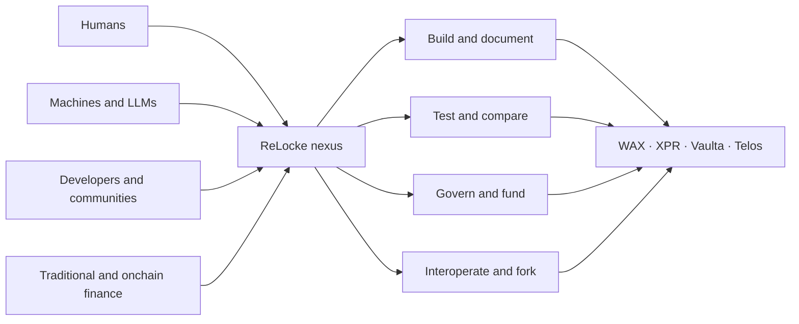

# ReLocke

## Infrastructure for open economic systems shared by humans and machines

ReLocke currently supports WAX, XPR Network, Vaulta, and Telos through a shared
GUI and GraphQL portal. Users, developers, applications, LLMs, and autonomous
agents can query accounts and contract state, discover and document deployed
contracts from their live ABIs, call contract actions, and prepare authorized
contract deployments and updates through one interface.

This working platform is the foundation for ReLocke's broader interoperability
and development layer for fragmented blockchain communities.

Our aim is to create a nexus where developers, communities, machines,
investors, and traditional and onchain financial systems can test competing
ideas in public. Economic and governance structures should be visible,
executable, measurable, and forkable—so their benefits can be demonstrated,
their weaknesses exposed, and better systems developed.

It is a place to reimagine money, value, authority, and institutional design as
systems that can be built, deployed, observed, challenged, and improved—not
only debated in theory.

Capital can provide soft power by supporting useful infrastructure and ideas.
Communities retain the freedom to disagree, fork, and leave. ReLocke preserves
the interface between them.

> **Decentralization creates fragmentation. ReLocke makes fragmentation
> interoperable.**

## Technology built

| Technology | Purpose |
| --- | --- |
| **ReLocke web portal** | A common interface for accounts, permissions, contracts, tables, actions, documentation, signing, and deployment. |
| **ReLockeQL** | Reads live contract ABIs and generates GraphQL queries and mutations through a shared multi-chain API. |
| **Agentic ABI** | Extends the executable ABI with contract intent, permissions, risks, side effects, provenance, versions, and context that people and machines can understand. |
| **Ricardian contract interface** | Displays human-readable contractual terms beside the executable smart-contract interface. Legal effect depends on the relevant agreement and law. |
| **CDT compiler endpoint** | A Vercel Function-compatible endpoint that accepts C++ source, compiles it inside an isolated Vercel Sandbox microVM, and returns WASM and ABI artifacts for browser review. |
| **Client-authorized deployment** | Deploys reviewed WASM and ABI artifacts using the permissions and signatures of the selected blockchain account. |
| **WebAuthn and K1 signing** | Supports Antelope WebAuthn/WA and secp256k1/K1 authorization paths. |
| **Multi-chain infrastructure** | Provides load-balanced access to WAX, XPR Network, Vaulta, and Telos while keeping each network's identity and governance explicit. |
| **Natural-language contract authoring** | Allows users to describe a smart contract in natural language and generate reviewable contract source and structure through the web portal. |

## Direction

ReLocke already supports natural-language-assisted smart-contract authoring.
The next step is to expand that capability from individual contracts into
complete applications, treasuries, financial systems, permission models, and
governance structures expressed in a familiar language. These designs can be
translated into reviewable specifications, Ricardian terms, contract source,
permissions, tests, simulations, and deployable artifacts.

Natural language will remain an authoring interface—not runtime truth.
Generated systems must be reviewed, compiled, tested, simulated, and explicitly
authorized before they control real authority or assets.

## Explore

- [ReLocke](https://relocke.io)
- [ReLocke concept paper](../WHITEPAPER.md)
- [ReLockeQL](https://github.com/pur3miish/ReLockeQL)
- [Agentic ABI](https://github.com/relocke/agentic-abi)
- [ReLocke Wallet](https://github.com/relocke/relocke-wallet)
- [WASM secp256k1](https://github.com/relocke/wasm-secp256k1)

RLOC Capital is a separate proposed capital-allocation structure. It is not a
current investment offering. Its legal, securities, custody, tax, governance,
and accounting architecture must be established independently from ReLocke's
public technology documentation.
